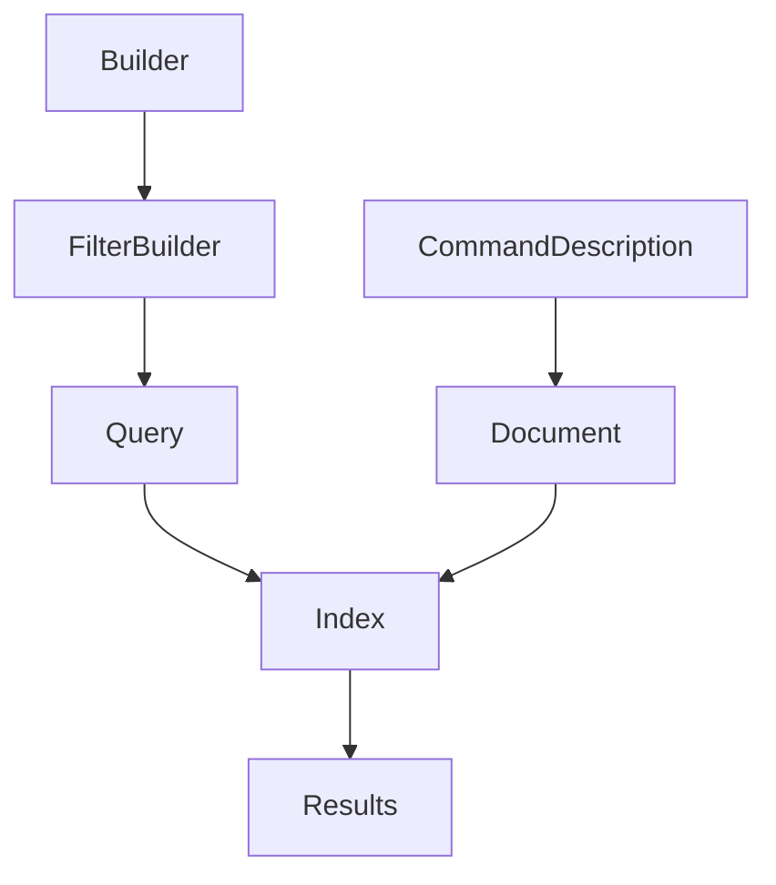

# System Patterns

## Command Filter Architecture

### Index Structure
1. Document Schema
   ```go
   type commandDocument struct {
       Name        string                 `json:"name"`
       NamePattern string                 `json:"name_pattern"`
       FullPath    string                 `json:"full_path"`
       Parents     []string              `json:"parents"`
       Type        string                 `json:"type"`
       Tags        []string              `json:"tags"`
       Metadata    map[string]interface{} `json:"metadata"`
   }
   ```

2. Field Analysis
   - `full_path`: Keyword analyzer (no tokenization)
   - `tags`: Array field for multiple values
   - `type`: Simple term field
   - `metadata`: Dynamic field for custom properties

### Query Patterns

1. Path-Based Queries
   ```go
   // Prefix matching
   builder.PathPrefix("service/")
   
   // Glob pattern matching
   builder.PathGlob("*/api/*")
   
   // Exact path matching
   builder.Path("service/api/http-api")
   ```

2. Boolean Combinations
   ```go
   // AND combination
   builder.PathPrefix("service/").And(builder.Type("http"))
   
   // OR combination
   builder.Types("http", "grpc").Or(builder.Tag("api"))
   
   // Complex combinations
   builder.PathGlob("*/api/*").And(
       builder.AllTags("stable", "api")
   )
   ```

3. Metadata Queries
   ```go
   // Single field
   builder.Metadata("version", "1.0.0")
   
   // Multiple fields
   builder.MetadataMatch(map[string]interface{}{
       "version": "1.0.0",
       "stage": "prod",
   })
   ```

### Index Configuration
1. Field Mappings
   ```go
   // Create keyword field mapping
   keywordFieldMapping := bleve.NewTextFieldMapping()
   keywordFieldMapping.Analyzer = "keyword"
   
   // Add to document mapping
   documentMapping := bleve.NewDocumentMapping()
   documentMapping.AddFieldMappingsAt("full_path", keywordFieldMapping)
   ```

2. Search Configuration
   ```go
   searchRequest := bleve.NewSearchRequest(query)
   searchRequest.Size = len(commands) // Get all matches
   ```

## Design Patterns

### Builder Pattern
- Used for constructing complex queries
- Fluent interface for query composition
- Type-safe query construction
- Encapsulates query complexity

### Command Pattern
- Commands as first-class objects
- Rich metadata and tagging
- Hierarchical organization
- Path-based discovery

### Search Pattern
- In-memory Bleve index
- Custom field analysis
- Boolean query composition
- Flexible matching strategies

## Component Relationships



## Technical Decisions

1. Text Analysis
   - Keyword analyzer for paths
   - Preserve path structure
   - No tokenization for exact matching

2. Query Construction
   - Fluent builder interface
   - Type-safe query composition
   - Flexible boolean operations

3. Index Management
   - In-memory storage
   - Custom field mappings
   - Efficient search execution

4. Result Handling
   - Full result set retrieval
   - Score-based ranking
   - Command reconstruction

## Implementation Patterns

1. **Filter Methods**
   ```go
   // Single value filters
   Type(type_ string) *FilterBuilder
   Tag(tag string) *FilterBuilder
   Path(path string) *FilterBuilder

   // Multiple value filters
   Types(types ...string) *FilterBuilder
   Tags(tags ...string) *FilterBuilder
   AllTags(tags ...string) *FilterBuilder

   // Pattern matching
   NamePattern(pattern string) *FilterBuilder
   PathGlob(pattern string) *FilterBuilder
   ```

2. **Boolean Operations**
   ```go
   // AND combination
   filter1.And(filter2, filter3)

   // OR combination
   filter1.Or(filter2, filter3)

   // NOT operation
   filter.Not()
   ```

3. **Error Handling**
   ```go
   // Helper for error handling
   Must(filter *FilterBuilder, err error) *FilterBuilder

   // Document validation
   func (d *commandDocument) validate() error
   ```

## Search Patterns

1. **Query Construction**
   ```go
   // Simple query
   builder.Type("http").Tag("api")

   // Complex query
   builder.Or(
       builder.Type("http"),
       builder.Type("grpc"),
   ).And(
       builder.AllTags("api", "v2"),
       builder.PathGlob("service/*/api"),
   )
   ```

2. **Result Processing**
   ```go
   // Search with context
   matches, err := index.Search(ctx, filter, commands)

   // Result collection
   matches := make([]*CommandDescription, 0, len(hits))
   for _, hit := range hits {
       // Match processing
   }
   ```

## Migration Patterns

1. **Backward Compatibility**
   - Maintain old filter types
   - Provide migration examples
   - Document upgrade path
   - Support both APIs during transition

2. **Deprecation Strategy**
   - Mark old types as deprecated
   - Provide conversion utilities
   - Document breaking changes
   - Set deprecation timeline 