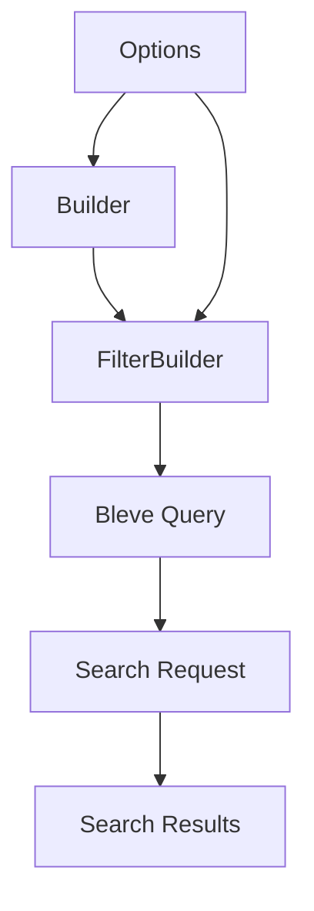

# Command Filter System Patterns

## Core Architecture

1. **Builder Pattern**
   ```go
   // Main builder interface
   type Builder struct {
       opts *Options
   }

   // Filter builder for combinations
   type FilterBuilder struct {
       query query.Query
       opts  *Options
   }

   // Usage example
   builder.Type("http").
       Tag("api").
       Build()
   ```

2. **Document Structure**
   ```go
   type commandDocument struct {
       Name        string                 `json:"name"`
       NamePattern string                 `json:"name_pattern"`
       FullPath    string                 `json:"full_path"`
       Parents     []string               `json:"parents"`
       Type        string                 `json:"type"`
       Tags        []string               `json:"tags"`
       Metadata    map[string]interface{} `json:"metadata"`
   }
   ```

3. **Search Flow**
   ```mermaid
   flowchart TD
       A[Create Builder] --> B[Build Filter]
       B --> C[Create Search Request]
       C --> D[Execute Search]
       D --> E[Process Results]
   ```

## Design Patterns

1. **Fluent Interface**
   - Method chaining for query building
   - Clear and readable query construction
   - Type-safe operations
   - Extensible design

2. **Options Pattern**
   ```go
   type Options struct {
       DefaultFieldBoost         float64
       DefaultConjunctionMinimum float64
       DefaultDisjunctionMinimum float64
   }

   type Option func(*Options)
   ```

3. **Factory Methods**
   ```go
   // Builder factory
   func New(opts ...Option) *Builder

   // Filter factory
   func NewFilterBuilder(q query.Query, opts *Options) *FilterBuilder

   // Helper factory
   func NewFilter(q query.Query) *FilterBuilder
   ```

## Component Relationships



## Implementation Patterns

1. **Filter Methods**
   ```go
   // Single value filters
   Type(type_ string) *FilterBuilder
   Tag(tag string) *FilterBuilder
   Path(path string) *FilterBuilder

   // Multiple value filters
   Types(types ...string) *FilterBuilder
   Tags(tags ...string) *FilterBuilder
   AllTags(tags ...string) *FilterBuilder

   // Pattern matching
   NamePattern(pattern string) *FilterBuilder
   PathGlob(pattern string) *FilterBuilder
   ```

2. **Boolean Operations**
   ```go
   // AND combination
   filter1.And(filter2, filter3)

   // OR combination
   filter1.Or(filter2, filter3)

   // NOT operation
   filter.Not()
   ```

3. **Error Handling**
   ```go
   // Helper for error handling
   Must(filter *FilterBuilder, err error) *FilterBuilder

   // Document validation
   func (d *commandDocument) validate() error
   ```

## Search Patterns

1. **Query Construction**
   ```go
   // Simple query
   builder.Type("http").Tag("api")

   // Complex query
   builder.Or(
       builder.Type("http"),
       builder.Type("grpc"),
   ).And(
       builder.AllTags("api", "v2"),
       builder.PathGlob("service/*/api"),
   )
   ```

2. **Result Processing**
   ```go
   // Search with context
   matches, err := index.Search(ctx, filter, commands)

   // Result collection
   matches := make([]*CommandDescription, 0, len(hits))
   for _, hit := range hits {
       // Match processing
   }
   ```

## Migration Patterns

1. **Backward Compatibility**
   - Maintain old filter types
   - Provide migration examples
   - Document upgrade path
   - Support both APIs during transition

2. **Deprecation Strategy**
   - Mark old types as deprecated
   - Provide conversion utilities
   - Document breaking changes
   - Set deprecation timeline 